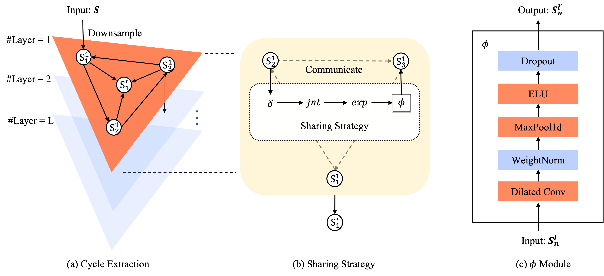

# CETRNet
The GitHub repository for the paper: "CETRNet: Time Series Forecasting with Cycle Extraction and Temporal Relations". 

We will update our code and data as soon as possible.

##  Used Datasets


ETT  (Electricity Transformer Temperature): This dataset records the load and temperature of power transformers at four time units.

Traffic : The dataset contains hourly road occupancy data collected from sensors located on highways in the San Francisco Bay Area, spanning the period from 2015 to 2016.

Electricity : This dataset comprises hourly electricity consumption data from 321 customers, covering the years 2012 to 2014.

ILI : This dataset consists of weekly data on influenza illness patients, recorded by the U.S. Centers for Disease Control and Prevention from 2002 to 2021. These datasets are suitable for evaluating the performance of the models in various application domains.

| Datasets    | Variants | Timesteps | Granularity |
| ----- | -- | --- | ----- |
| ETTh1       | 7        | 17,420    | 1hour       |
| ETTh2       | 7        | 17,420    | 1hour       |
| ETTm1       | 7        | 69,680    | 5mins       |
| ETTm2       | 7        | 69,680    | 5mins       |
| Traffic     | 862      | 17,544    | 1hour       |
| Electricity | 321      | 26,304    | 1hour       |
| ILI         | 7        | 966       | 1week       |

## Baselines


**LTSF-Linear**(AAAI 2023)

**FilM**(NeurIPS 2022)

**SCINet**(NeurIPS 2022)

**FEDformer** (via Fourier transform)(ICML 2022)

**Autoformer**(NeurIPS 2021)

**Informer**(AAAI 2021 Best Paper)

**LogTrans**(NeurIPS 2019)

## CETRNet Architecture



The overall architecture of CETRNet.(a) represents the complete Cycle Extraction downsampling architecture, with the orange layer depicting the current layer. Each node cycles to capture temporal dependencies and generate a new node for the subsequent layer. (b) illustrates the sharing strategy, the method for exchanging information between nodes. The content within the dotted box outlines the four steps of this strategy, culminating in (c), which details the technical composition of the final step.

## Get started

### Environment

We use NVIDIA GeForce RTX 3090 24GB GPU.

```
PyTorch v1.9.1--1--Ubuntu 18.04.6 LTS PyTorch v1.9.1 CUDA Version:11.1.105
```

### Requirements

```
pandas
matplotlib
scikit-learn
```

You can just run

```
pip install -r ./requirements.txt
```

### Run scripts

You can find detailed scripts in the *scripts* folder.

#### For ETTh1 dataset:

```shell
# Multivariate
# 96
python3 -u run_longExp.py \
--is_training 1 \
--root_path ./dataset/ETT \
--data_path ETTh1.csv \
--model_id cetrnet_ETTh1_96_96 \
--model CETRNet \
--dataset ETTh1 \
--features M \
--seq_len 192 \
--pred_len 96 \
--enc_in 7 \
--des 'Exp' \
--itr 1 \
--batch_size 8 \
--learning_rate 0.01 \
--num_levels 3 \
--dropout 0.05 \
--train_epochs 20 > logs/etth1/S_cetrnet_etth1_pl96_sl192_bs8_nl3.log &

# 192
python3 -u run_longExp.py \
--is_training 1 \
--root_path ./dataset/ETT \
--data_path ETTh1.csv \
--model_id cetrnet_ETTh1_192_192 \
--model CETRNet \
--dataset ETTh1 \
--features M \
--seq_len 336 \
--pred_len 192 \
--enc_in 7 \
--des 'Exp' \
--itr 1 \
--batch_size 32 \
--learning_rate 0.01 \
--num_levels 3 \
--dropout 0.05 \
--train_epochs 20 > logs/etth1/S_cetrnet_etth1_pl192_sl336_bs32_nl3.log &

# 336
python3 -u run_longExp.py \
--is_training 1 \
--root_path ./dataset/ETT \
--data_path ETTh1.csv \
--model_id cetrnet_ETTh1_336_336 \
--model CETRNet \
--dataset ETTh1 \
--features M \
--seq_len 336 \
--pred_len 336 \
--enc_in 7 \
--des 'Exp' \
--itr 1 \
--batch_size 256 \
--learning_rate 0.01 \
--num_levels 2 \
--dropout 0.05 \
--train_epochs 20 > logs/etth1/S_cetrnet_etth1_pl336_sl336_bs256_nl2.log &

# 720
python3 -u run_longExp.py \
--is_training 1 \
--root_path ./dataset/ETT \
--data_path ETTh1.csv \
--model_id cetrnet_ETTh1_720_720 \
--model CETRNet \
--dataset ETTh1 \
--features M \
--seq_len 720 \
--pred_len 720 \
--enc_in 7 \
--des 'Exp' \
--itr 1 \
--batch_size 64 \
--learning_rate 0.01 \
--num_levels 2 \
--dropout 0.05 \
--train_epochs 20 > logs/etth1/S_cetrnet_etth1_pl720_sl720_bs64_nl2.log &

# Univariate
# 96
nohup python3 -u run_longExp.py \
--is_training 1 \
--root_path ./dataset/ETT \
--data_path ETTh1.csv \
--model_id cetrnet_ETTh1_96_96 \
--model CETRNet \
--dataset ETTh1 \
--features S \
--seq_len 336 \
--pred_len 96 \
--enc_in 1 \
--des 'Exp' \
--itr 1 \
--batch_size 32 \
--learning_rate 0.01 \
--num_levels 2 \
--dropout 0.05 \
--train_epochs 20 > logs/etth1/S_cetrnet_ETTh1_pl096_sl336_bs32_nl2.log &

# 192
nohup python3 -u run_longExp.py \
--is_training 1 \
--root_path ./dataset/ETT \
--data_path ETTh1.csv \
--model_id cetrnet_ETTh1_192_192 \
--model CETRNet \
--dataset ETTh1 \
--features S \
--seq_len 192 \
--pred_len 192 \
--enc_in 1 \
--des 'Exp' \
--itr 1 \
--batch_size 128 \
--learning_rate 0.01 \
--num_levels 1 \
--dropout 0.05 \
--train_epochs 20 > logs/etth1/S_cetrnet_etth1_pl192_sl192_bs128_nl1.log &

# 336
nohup python3 -u run_longExp.py \
--is_training 1 \
--root_path ./dataset/ETT \
--data_path ETTh1.csv \
--model_id cetrnet_ETTh1_336_336 \
--model CETRNet \
--dataset ETTh1 \
--features S \
--seq_len 336 \
--pred_len 336 \
--enc_in 1 \
--des 'Exp' \
--itr 1 \
--batch_size 256 \
--learning_rate 0.01 \
--num_levels 2 \
--dropout 0.05 \
--train_epochs 20 > logs/etth1/S_cetrnet_etth1_pl336_sl336_bs256_nl2.log &

# 720
nohup python3 -u run_longExp.py \
--is_training 1 \
--root_path ./dataset/ETT \
--data_path ETTh1.csv \
--model_id cetrnet_ETTh1_720_720 \
--model CETRNet \
--dataset ETTh1 \
--features S \
--seq_len 192 \
--pred_len 720 \
--enc_in 1 \
--des 'Exp' \
--itr 1 \
--batch_size 128 \
--learning_rate 0.01 \
--num_levels 2 \
--dropout 0.05 \
--train_epochs 20 > logs/etth1/S_cetrnet_etth1_pl720_sl192_bs128_nl2.log &
```


## Contact

If you have any problems, feel free to contact us.
```
Hancheng Chen: hcchan@zju.edu.cn
```


## Acknowledgements


We acknowledge and appreciate the contributions of the research community, and we extend our gratitude to the laboratories and authors for making their open-source code available.

